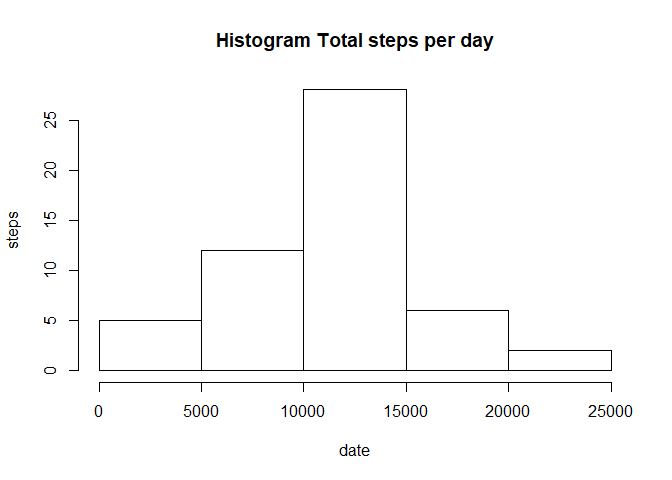
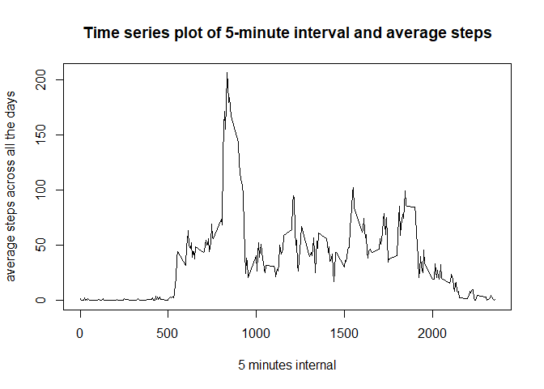
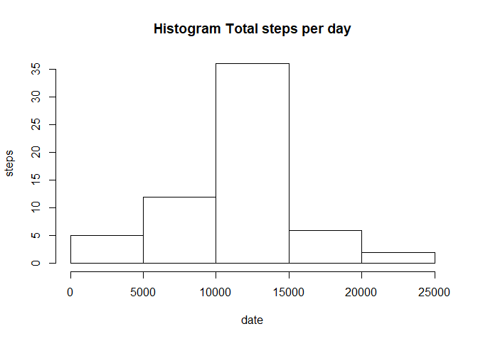
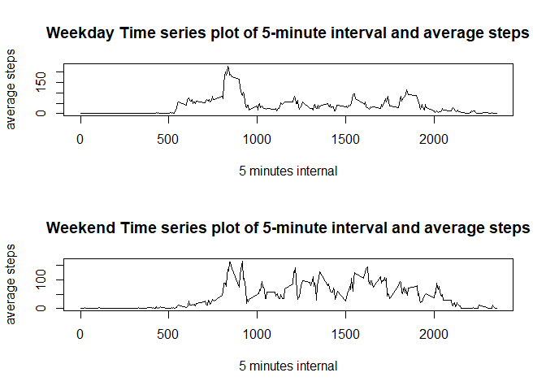

## Loading and preprocessing the data

```r
ds <- read.csv("activity.csv",stringsAsFactors = FALSE)
ds$date <- as.Date(ds$date,"%Y-%m-%d")
str(ds)
```

```
## 'data.frame':	17568 obs. of  3 variables:
##  $ steps   : int  NA NA NA NA NA NA NA NA NA NA ...
##  $ date    : Date, format: "2012-10-01" "2012-10-01" ...
##  $ interval: int  0 5 10 15 20 25 30 35 40 45 ...
```


## What is mean total number of steps taken per day?
* Histogram of the total number of steps taken each day

```r
ds_spd <- tapply(ds$steps,ds$date,sum)
hist(ds_spd, main="Histogram Total steps per day",xlab="date",ylab="steps")
```

<!-- -->

* The mean total number of steps taken per day

```r
mean(ds_spd,na.rm=TRUE)
```

```
## [1] 10766.19
```
* The median total number of steps taken per day

```r
median(ds_spd,na.rm=TRUE)
```

```
## [1] 10765
```

## What is the average daily activity pattern?
* Time series plot of the 5-minute interval and the average number of steps taken

```r
ds_spi <- tapply(ds$steps,ds$interval,mean,na.rm=TRUE)
plot(ds_spi, main="Time series plot of 5-minute interval and average steps",xlab="5 minutes internal",ylab="average steps across all the days",type="l",x=names(ds_spi))
```

<!-- -->

## Imputing missing values
* Total num of rows with NA

```r
sum(!complete.cases(ds))
```

```
## [1] 2304
```
* New dataset that is equal to the original dataset but with the missing data filled in which is mean steps of 5 minutes interval

```r
ds_new <- ds
ds_new$steps<-ave(ds_new$steps,ds_new$interval,FUN=function(x) 
  ifelse(is.na(x), mean(x,na.rm=TRUE), x))
```
* New dataset Histogram of the total number of steps taken each day

```r
ds_new_spd <- tapply(ds_new$steps,ds_new$date,sum)
hist(ds_new_spd, main="Histogram Total steps per day",xlab="date",ylab="steps")
```

<!-- -->

* The New dataset mean total number of steps taken per day

```r
mean(ds_new_spd,na.rm=TRUE)
```

```
## [1] 10766.19
```
* The New dataset median total number of steps taken per day

```r
median(ds_new_spd,na.rm=TRUE)
```

```
## [1] 10766.19
```

## Are there differences in activity patterns between weekdays and weekends?

```r
weekdays1 <- c('星期一', '星期二', '星期三', '星期四', '星期五')
ds_new$weekdays <- factor((weekdays(ds_new$date) %in% weekdays1), levels=c(FALSE, TRUE), labels=c('weekend', 'weekday'))
ds_new_weekday <- subset(ds_new,weekdays=="weekday")
ds_new_weekend <- subset(ds_new,weekdays=="weekend")
ds_new_weekday_spi <- tapply(ds_new_weekday$steps,ds_new_weekday$interval,mean,na.rm=TRUE)
ds_new_weekend_spi <- tapply(ds_new_weekend$steps,ds_new_weekend$interval,mean,na.rm=TRUE)
par(mfrow = c(2, 1))
plot(ds_new_weekday_spi, main="Weekday Time series plot of 5-minute interval and average steps",xlab="5 minutes internal",ylab="average steps",type="l",x=names(ds_new_weekday_spi))
plot(ds_new_weekend_spi, main="Weekend Time series plot of 5-minute interval and average steps",xlab="5 minutes internal",ylab="average steps",type="l",x=names(ds_new_weekend_spi))
```

<!-- -->

